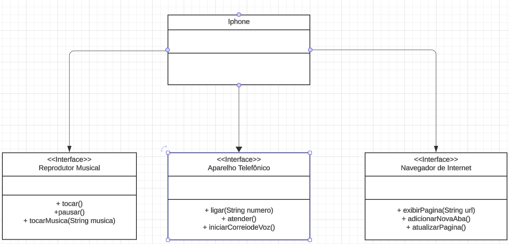

# Projeto iPhone Componente

Este projeto consiste na modelagem e implementação das funcionalidades de um componente iPhone, utilizando conceitos de modelagem UML e programação em Java.

## Funcionalidades Modeladas

O componente iPhone foi modelado com as seguintes funcionalidades principais:

- **Reprodutor Musical**
  - Métodos: `tocar()`, `pausar()`, `selecionarMusica(String musica)`

- **Aparelho Telefônico**
  - Métodos: `ligar(String numero)`, `atender()`, `iniciarCorreioVoz()`

- **Navegador na Internet**
  - Métodos: `exibirPagina(String url)`, `adicionarNovaAba()`, `atualizarPagina()`

## Estrutura do Projeto

O projeto está estruturado da seguinte forma:

- **`README.md`**: Este arquivo, contendo informações sobre o projeto.
- **Diagrama UML**: Representação visual das classes e interfaces do componente iPhone.
- **Código Fonte**: Implementação das classes e interfaces em Java.

## Diagrama UML

O diagrama UML representa as classes e interfaces do componente iPhone, conforme modelado:

## Implementação em Java

A implementação das interfaces e da classe `iPhone` em Java está disponível no diretório `src/` deste repositório.

## Como Executar

Para executar o projeto, você pode compilar os arquivos `.java` e rodar a classe principal `iPhoneMain`.

